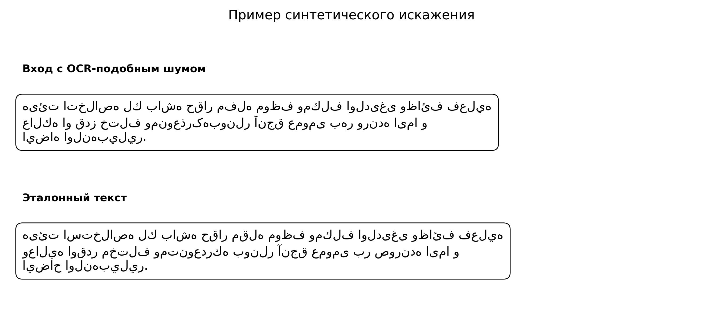
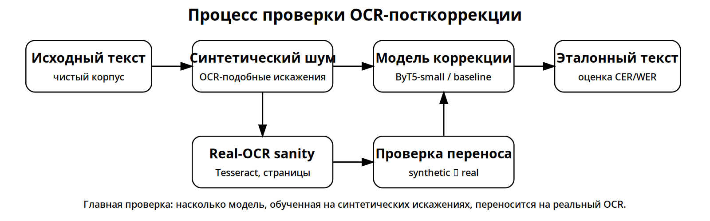
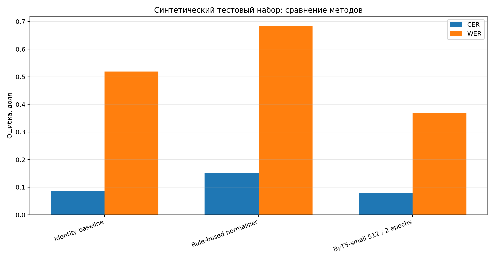
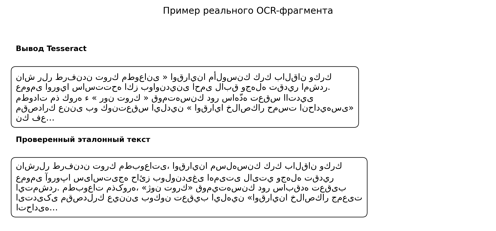
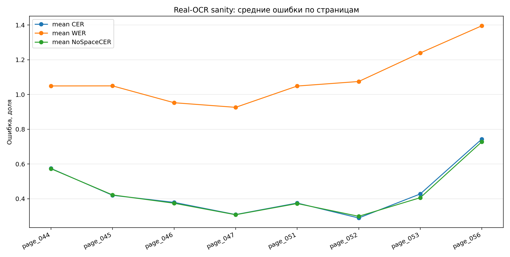

<div align="center">

**Национальный исследовательский университет**<br>
**«Высшая школа экономики»**<br>
**Факультет компьютерных наук**<br>
**Образовательная программа:** Исследования и предпринимательство в искусственном интеллекте

<br><br>

**Методы искусственного интеллекта для распознавания и анализа исторических текстов на арабско-тюркской графике**

*AI methods for recognition and analysis of historical texts in Arabic–Turkic script*

<br>

**Курсовая работа**

<br><br>

</div>

**Выполнил:** студент 1 курса<br>
Исламов Радмир Рашитович

**Научный руководитель:** Макаров Илья Андреевич, доцент департамента анализа данных и искусственного интеллекта ФКН НИУ ВШЭ<br>
**E-mail:** iamakarov@hse.ru<br>
**Телефон:** +7(915)152-4532

<br><br>

<div align="center">

Москва, 2026

</div>


```{=openxml}
<w:p><w:r><w:br w:type="page"/></w:r></w:p>
```

# Аннотация

В работе исследуется посткоррекция OCR-вывода для исторических тюркских текстов в арабской графике. Полный цикл распознавания изображений здесь не строится: эксперимент ограничен текстовым этапом, где на вход подаётся OCR-строка, а на выходе ожидается исправленный вариант, сопоставимый с эталоном.

Пилотным материалом служит османско-турецкий текст в арабской графике. Он не заменяет старотатарский или старобашкирский набор данных, но позволяет проверить протокол на близком тюркском материале. На основе проверенных строк построен синтетический набор пар «искажённый текст — эталонный текст». В эксперименте сравниваются метод без исправления, нормализатор на правилах, символьный метод на основе ошибок обучающей выборки и ByT5-small.

На синтетическом наборе ByT5-small показывает лучший результат среди рассмотренных методов, особенно по WER. Однако дополнительная проверка на реальном OCR-выводе Tesseract меняет интерпретацию результата: модель, обученная только на синтетических искажениях, не переносится надёжно на постраничный реальный OCR. Она может немного улучшать WER, но ухудшать CER и NoSpaceCER относительно исходного Tesseract.

Главный результат работы состоит не в создании готовой OCR-системы, а в построении воспроизводимого протокола оценки и фиксации разрыва между синтетической и реальной проверкой. Для практического применения нужны выровненные пары «OCR-вывод — эталон», обучение на настоящих OCR-ошибках, проверка на татарских и башкирских источниках и ручной анализ ошибок.

## 1. Введение

Исторические тюркские тексты в арабской графике важны для изучения истории, культуры, религии, права, повседневности и интеллектуальной традиции тюркских народов. К таким материалам относятся османские, татарские, башкирские, крымскотатарские и другие источники, созданные до перехода соответствующих письменных традиций на латиницу или кириллицу.

Для автоматической обработки это трудный материал. Историческая орфография отличается от современной нормы, арабская графика плохо переносится на стандартные OCR-сценарии, а размеченных корпусов значительно меньше, чем для современных массовых языков. Даже когда скан доступен, исследователь часто получает не готовый текстовый корпус, а изображение или OCR-вывод с большим числом ошибок.

В этой работе не ставится задача решить всю проблему распознавания исторических документов. Полная технологическая цепочка включает поиск источника, обработку изображения, разметку строк, OCR/HTR, посткоррекцию, проверку текста и последующий анализ. Здесь рассматривается более узкий слой: исправление уже полученного текстового вывода. Такое сужение делает эксперимент проверяемым: на вход подаётся OCR-текст, на выходе получается исправленная строка, а качество измеряется относительно эталона.

Работа проверяет важное ограничение синтетического подхода. Если реальных пар «OCR-вывод — проверенный эталон» мало, естественный первый шаг состоит в искусственной генерации ошибок. Но успех на таком наборе не подтверждает работу модели на настоящем OCR. Поэтому эксперимент разделён на два уровня: контролируемую проверку на синтетических искажениях и отдельную постраничную проверку на реальном OCR османско-турецкого печатного источника.

## 1.1 Актуальность

Актуальность работы связана не только с OCR как технической задачей. Без машинно-читаемого текста исторические источники трудно включать в поиск, корпусный анализ, извлечение имён и топонимов, сопоставление записей и проверку историко-лингвистических гипотез.

Для арабографичных тюркских материалов эта проблема особенно заметна. Такие тексты слабо представлены в готовых OCR- и NLP-ресурсах; стандартные модели, обученные на современных языках и более регулярной орфографии, не обязательно справляются с историческим письмом. Даже частично распознанный текст часто требует отдельного слоя исправления: похожие графемы, пропуски, лишние символы и ошибки пробелов мешают дальнейшему анализу.

Ещё одна причина актуальности связана с нехваткой воспроизводимых тестовых наборов и протоколов оценки. Для низкоресурсного исторического материала недостаточно показать один удачный пример исправления. Нужно фиксировать источник данных, процедуру генерации или получения OCR, разбиение на обучающую и тестовую части, метрики и худшие случаи. Поэтому в работе важны не только значения CER и WER, но и воспроизводимый протокол оценки.

## 1.2 Постановка проблемы

Основная проблема состоит в том, что для исторических тюркских текстов в арабской графике пока не хватает небольших, но воспроизводимых экспериментальных контуров для проверки посткоррекции OCR. Без такого контура трудно понять, что именно улучшает модель: реальные ошибки распознавания, искусственно внесённый шум, пробелы, локальные замены графем или только отдельные удачные примеры.

В этой работе проблема сведена к проверяемой постановке. Нужно построить пары «искажённый OCR-текст — эталон», обучить и сравнить несколько методов посткоррекции, а затем проверить перенос с синтетических ошибок на реальный OCR. Важное ограничение формулируется заранее: османско-турецкий источник используется как близкий тюркский материал в арабской графике, но не подаётся как старотатарский или старобашкирский набор данных.

Такое сужение позволяет отделить ошибки посткоррекции от ошибок сегментации, распознавания изображения и подготовки скана. В то же время оно не снимает более крупную задачу: для практической системы всё равно понадобятся реальные пары «OCR-вывод — эталон», ручная валидация и расширение корпуса на целевые татарские и башкирские источники.

## 1.3 Цель работы

Цель работы состоит в построении и оценке протокола посткоррекции OCR-подобных ошибок для исторических тюркских текстов в арабской графике, а также в проверке переноса модели с синтетических искажений на реальный OCR-вывод.

## 1.4 Задачи работы

Для достижения цели необходимо решить следующие задачи:

1. Описать особенности автоматической обработки тюркских текстов в арабской графике.
2. Собрать небольшой корпус тюркского текста в арабской графике и зафиксировать его ограничения.
3. Построить синтетический набор пар «искажённый текст — эталонный текст» для задачи посткоррекции OCR.
4. Выполнить разбиение данных на обучающую, валидационную и тестовую выборки без утечки исходных строк.
5. Реализовать и оценить базовые методы: вариант без исправления, нормализатор на правилах и символьный метод на основе ошибок обучающей выборки.
6. Обучить ByT5-small для исправления OCR-подобных ошибок и сравнить варианты с разной длиной последовательности.
7. Оценить методы с помощью CER, WER, NoSpaceCER и ExactMatch, а также провести разбор улучшенных и ухудшенных примеров.
8. Проверить перенос на реальный OCR-вывод Tesseract и сформулировать ограничения синтетического обучения.

## 1.5 Объект и предмет исследования

Объект исследования составляют исторические тюркские тексты в арабской графике.

Предмет исследования составляют методы посткоррекции OCR-подобных ошибок в таких текстах: правила, символьные замены и нейросетевая модель ByT5-small.

## 1.6 Исследовательские вопросы

В работе рассматриваются следующие исследовательские вопросы:

1. Улучшает ли ByT5-small качество синтетически искажённого арабографичного тюркского текста по сравнению с базовым вариантом без исправления?
2. Достаточны ли простые правила и символьные замены для такой задачи?
3. Насколько заметен выигрыш модели по CER, WER и NoSpaceCER, и не связан ли он преимущественно с исправлением пробелов?
4. Как влияет максимальная длина последовательности на качество модели с байтовым представлением при работе с арабской графикой?
5. Сохраняется ли выигрыш модели, обученной на синтетических ошибках, на реальном OCR-выводе Tesseract?

## 1.7 Гипотезы

В работе проверяются следующие гипотезы.

Гипотеза 1. Простая нормализация на правилах может ухудшать качество арабографичного тюркского текста, поскольку способна искажать значимые орфографические особенности.

Гипотеза 2. Модель ByT5-small с байтовым представлением способна улучшить качество посткоррекции OCR по сравнению с методом без исправления.

Гипотеза 3. Увеличение максимальной длины последовательности с 256 до 512 должно улучшить результат, поскольку ByT5 кодирует текст на уровне байтов, а один видимый символ арабской графики может занимать несколько байтов.

Гипотеза 4. Модель, обученная только на синтетических OCR-подобных ошибках, не будет надёжно переноситься на реальный постраничный OCR без адаптации на настоящих парах «OCR-вывод — эталон».

## 1.8 Практическая значимость

Практический результат работы — не готовый OCR-инструмент, а проверяемая схема эксперимента: источник, способ генерации ошибок, разбиение данных, базовые методы, метрики и проверка на реальном OCR. Такой контур можно расширить до пар «OCR-вывод — эталон» для старотатарских и старобашкирских источников и использовать как основу для более строгой оценки посткоррекции.

Практический смысл результата связан с цифровой гуманитаристикой. После появления реальных пар «OCR-вывод — эталон» этот контур можно применять для подготовки корпусов, поиска по историческим текстам, извлечения именованных сущностей и сопоставления архивных записей. Текущая версия честно фиксирует границу применимости: она показывает разрыв между синтетической и реальной оценкой, но не является готовым корректором для архивных сканов.

## 1.9 Структура работы

Логика работы следующая: сначала рассматриваются трудности OCR исторических документов и арабографичного письма, затем описываются корпус и синтетические ошибки, после этого сравниваются базовые методы и ByT5-small, а в конце отдельно проверяется перенос на реальный OCR-вывод Tesseract.

## 2. Обзор предметной области и связанных работ

### 2.1 OCR исторических документов как воспроизводимый процесс

OCR исторических документов отличается от распознавания современных печатных текстов не одной отдельной трудностью, а сочетанием факторов: качеством скана, типографикой, состоянием страницы, сегментацией строк, структурой страницы и исторической вариативностью письма. Поэтому в работах по OCR исторических документов задача обычно рассматривается не только как запуск модели распознавания, а как воспроизводимый процесс: подготовка изображения, сегментация, создание эталонной разметки, обучение или настройка OCR/HTR, постобработка и ручная валидация.

Для этой работы такой взгляд важен по двум причинам. Во-первых, рассматриваемая модель не заменяет OCR-систему целиком: она работает после получения OCR-вывода. Во-вторых, качество оценки зависит от связи между изображением, строкой и эталонной транскрипцией. OCR4all показывает значимость связки инструментов для исторических печатных источников (Reul et al., 2019), а работы об эталонной разметке подчёркивают необходимость корректного соответствия между изображением и эталоном (Springmann et al., 2018).

Современные OCR-модели также всё чаще строятся на трансформерных подходах. Например, TrOCR использует предобученные компоненты визуального и текстового трансформеров и показывает, что сама OCR-модель может выигрывать от предобучения и дообучения на размеченных данных (Li et al., 2021). Однако это направление относится к распознаванию изображения, тогда как настоящая работа ограничена текстовой посткоррекцией. Такое ограничение сужает эксперимент, зато позволяет проверить отдельный вопрос: может ли модель исправлять уже полученный OCR-вывод без смешения этого результата с качеством сегментации и распознавания изображения.

### 2.2 Специфика арабографичного OCR

OCR для арабской графики обычно рассматривается как отдельный класс задач. Буквы меняют форму в зависимости от позиции в слове, письмо является связным, а различия между рядом символов могут задаваться небольшими графическими элементами, например точками. В обзорах OCR для арабской графики эти свойства выделяются как одна из причин, по которым прямой перенос подходов, хорошо работающих для латинской графики, оказывается недостаточным (Kasem et al., 2023). Для печатных арабографичных материалов дополнительно важны многошрифтовость, близость начертаний и нестабильность качества сканов (Osman et al., 2020).

Для данной работы это означает, что ошибка OCR не сводится к случайной замене символа на символ. В арабской графике похожие графемы могут отличаться небольшими деталями, а ошибка сегментации или порядка чтения может резко ухудшать последующую посткоррекцию. Поэтому генератор синтетического шума полезен как контролируемая постановка, но его ошибки не обязаны совпадать с реальными ошибками Tesseract или другой OCR/HTR-системы.

В исторических тюркских текстах арабская графика усложняется ещё сильнее: в одном материале могут сосуществовать арабские, персидские и тюркские орфографические практики. Для тюркских языков арабское письмо адаптировалось под звуки, которые не всегда имели прямые соответствия в классической арабской письменности. Поэтому один и тот же символ может быть одновременно технической единицей OCR и носителем историко-орфографической информации.

Именно здесь возникает разрыв между синтетической и реальной проверкой. В синтетической постановке можно контролировать типы искажений и разбиение на обучающую и тестовую выборки. В реальном OCR появляются дополнительные факторы: структура страницы, шрифт, качество изображения, сегментация строк, направление письма и особенности конкретной OCR-системы. Поэтому результаты на синтетическом наборе нельзя автоматически переносить на настоящий OCR-вывод.

### 2.3 Тюркские тексты в арабской графике и османско-турецкий материал

Тюркские языки в разные исторические периоды использовали разные письменности, включая арабскую графику. Для османско-тюркских материалов эта проблема особенно заметна: после перехода турецкого языка на латиницу значительная часть печатного наследия осталась в форме, трудной для массового поиска и автоматической обработки. Работы по автоматической транскрипции османско-турецких периодических изданий показывают, что архивы на нелатинской графике требуют отдельной инфраструктуры, подготовки данных и проверки качества распознавания (Kirmizialtin & Wrisley, 2020).

В этой работе османско-турецкий источник используется как близкий тюркский материал в арабской графике. Проверка на реальном OCR не является старотатарским или старобашкирским набором данных. Татарские и башкирские источники остаются целью следующего этапа, а османско-турецкий материал выбран потому, что для него удалось сопоставить сканы страниц и постраничный эталонный текст.

С точки зрения обработки естественного языка такие материалы относятся к низкоресурсным историческим данным. Для них меньше размеченных корпусов, стандартных бенчмарков, готовых моделей и инструментов, чем для современных массовых языков. Современные работы по обработке исторического турецкого языка подчёркивают необходимость создавать базовые ресурсы: корпуса, модели, разметку и инструменты для анализа исторических текстов (Özateş et al., 2025). Настоящая работа занимает в этой цепочке более узкое место: она не строит полный корпус, а проверяет протокол посткоррекции.

### 2.4 Посткоррекция OCR как преобразование искажённого текста в эталонный

Под посткоррекцией OCR понимается преобразование ошибочного OCR-вывода в более корректный текст. На уровне строки или короткого фрагмента эта задача формулируется как преобразование одной последовательности в другую: модель получает искажённый или OCR-текст и должна восстановить эталонный текст. Такой подход используется в работах по нейросетевой посткоррекции OCR, включая методы на основе нейронного машинного перевода и посимвольные модели преобразования последовательностей (Hämäläinen & Hengchen, 2019; Ramirez-Orta et al., 2021).

При этом посткоррекцию OCR нельзя полностью отождествлять с нормализацией исторического написания. Коррекция OCR исправляет технические ошибки распознавания, а нормализация орфографии может менять варианты написания в сторону некоторой нормы. В литературе эти задачи иногда рассматриваются рядом, но для исторического материала их важно разводить, чтобы не стереть значимые орфографические особенности (Duong et al., 2020).

Для исторических корпусов особенно важна оценка на уровне символов. Ошибки OCR появляются из-за похожих графем, нестабильных шрифтов, качества скана, старой орфографии и сегментации слов. Lyu et al. (2021) связывают последующую коррекцию исторических корпусов с посимвольными ошибками, сегментацией слов и исторической вариативностью языка. Это близко к метрикам настоящей работы: CER и NoSpaceCER здесь важнее, чем один только WER, потому что улучшение на уровне слов может возникать из-за исправления пробелов и не гарантировать лучшего распознавания символов.

Для низкоресурсных языков посткоррекция дополнительно ограничивается нехваткой вручную проверенных пар «OCR-вывод — эталон». Rijhwani et al. (2021) показывают, что нейросетевая посткоррекция для низкоресурсных и исчезающих языков зависит от дефицита вручную подготовленных коррекционных данных, а самообучение и декодирование с учётом лексики помогают использовать неразмеченные изображения и распознанные тексты. Это напрямую связано с данной работой: обучение только на синтетическом шуме даёт контролируемую базовую проверку, но следующий шаг требует адаптации к реальным OCR-ошибкам на выровненных парах.

Отдельная современная линия исследований связана с использованием больших языковых моделей для коррекции OCR. Kanerva et al. (2025) показывают, что посткоррекция на основе больших языковых моделей для исторических документов не даёт универсального выигрыша: эффект зависит от языка, данных и постановки. Этот вывод важен для интерпретации настоящего эксперимента. Смешанный перенос модели, обученной на синтетических искажениях, на реальный OCR отражает известную проблему посткоррекции: качество зависит от домена, языка, структуры ошибок и объёма размеченных пар «OCR-вывод — эталон».

### 2.5 Синтетические данные для посткоррекции OCR
В идеальном случае модель посткоррекции обучается не на искусственно испорченных строках, а на парах реального OCR/HTR-вывода и вручную проверенного текста. Для исторических и низкоресурсных материалов такой вариант часто недоступен: сначала приходится собрать источник, получить распознавание, выровнять строки и только потом проверять исправления. Поэтому синтетические данные в этой работе используются не как замена реального OCR, а как первый контролируемый уровень эксперимента.

В литературе такой ход встречается в разных низкоресурсных постановках. Например, работы по OCR исторических текстов на иврите показывают, что искусственно построенные пары могут быть полезны, когда ручной разметки мало (Suissa et al., 2023). Naiman et al. (2023) также используют крупные синтетические наборы для посткоррекции исторических научных статей и оценивают эффект по CER и WER. Для моей работы из этого следует не то, что синтетика «достаточна», а более узкий вывод: на ней можно проверить код, метрики, разбиение и базовое сравнение методов до появления настоящих OCR-пар.

Отдельный вопрос — как именно создавать ошибки. Если шум слишком общий, модель учится исправлять не ошибки OCR, а ошибки выбранного генератора. Guan and Greene (2024) специально обсуждают роль объёма данных, расширения выборки и способов генерации синтетических ошибок; среди важных факторов выделяются сходство глифов и низкоресурсный режим. Это особенно важно для арабской графики, где многие ошибки связаны не с произвольной заменой символов, а с близостью начертаний, точками, формами букв и сегментацией строки.

RoundTripOCR показывает другой полезный ракурс: низкоресурсную посткоррекцию можно рассматривать как преобразование искажённого текста в эталонный по аналогии с переводом (Kashid & Bhattacharyya, 2024). В моей постановке эта идея используется на уровне строки: модель получает искажённый арабографичный фрагмент и должна восстановить эталонную запись. При этом перенос на настоящий OCR проверяется отдельно, потому что синтетический набор не содержит качества скана, шрифта, структуры страницы и ошибок Tesseract.

Следовательно, синтетический набор в этой работе — это диагностический стенд, а не финальный бенчмарк. Он нужен, чтобы увидеть, превосходит ли ByT5-small простые базовые методы в контролируемой среде. Постраничная проверка на Tesseract затем показывает границу этого стенда: для практического применения нужно строить ошибки не только по заранее заданным правилам, но и по реальным OCR-выводам и эмпирическим путаницам арабографичных графем.

### 2.6 Модели с байтовым представлением и выбор ByT5

В работе используется ByT5-small. ByT5 относится к моделям преобразования последовательностей с байтовым представлением: она работает на уровне байтов, а не заранее заданных слов или подсловных единиц (Xue et al., 2021). Для низкоресурсного исторического материала это важно, потому что обычный токенизатор по подсловным единицам может плохо покрывать редкие графемы, нестандартные написания, смешение письменных традиций и OCR-шум.

Выбор ByT5 также связан с постановкой преобразования искажённого текста в эталонный. Архитектура преобразования текста в текст позволяет формулировать посткоррекцию как преобразование одной последовательности в другую, что наследует общую логику T5 (Raffel et al., 2019) и трансформерного моделирования последовательностей (Vaswani et al., 2017). При этом байтовое представление особенно удобно для арабографичных текстов, где видимые символы и их Unicode-представление могут быть нестабильны, а ошибки часто проявляются на уровне отдельных графем.

Тем не менее модель с байтовым представлением не решает проблему доменного переноса автоматически. Если модель обучена только на синтетическом шуме, она учится распределению ошибок этого генератора. Реальный OCR-вывод может иметь другую структуру: пропуски, артефакты разметки страницы, ошибки чтения строк, необычные пробелы, неверные формы букв или последовательные искажения. Поэтому ByT5 в этой работе рассматривается как сильная нейросетевая точка сравнения для посткоррекции, но не как готовое универсальное решение.

### 2.7 Позиция данной работы относительно существующих исследований
Рассмотренные работы задают рамку, в которой находится эта курсовая. С одной стороны, OCR исторических документов требует полного процесса: подготовки изображения, сегментации, распознавания, эталонной разметки и ручной проверки. С другой стороны, моя работа сознательно выносит за скобки распознавание изображения и проверяет только следующий слой — текстовую посткоррекцию уже полученного OCR-вывода.

Из обзора также следует, почему для арабографичного материала нельзя ограничиться универсальной схемой «зашумить строку и обучить модель». В арабской графике важны форма буквы в слове, точки, близость начертаний, качество печати и ошибки разбиения строки. Поэтому синтетический шум в работе трактуется как приближение, а не как модель всех реальных ошибок. Именно поэтому в эксперимент добавлена отдельная проверка на постраничном OCR Tesseract.

Вклад работы находится на этом промежуточном уровне. Она не предлагает новую OCR/HTR-систему и не претендует на лучший результат в распознавании исторических документов. Более точная формулировка вклада такая: построен воспроизводимый контур для проверки посткоррекции тюркского текста в арабской графике; реализованы простые методы сравнения; обучена ByT5-small; отдельно показано, что успех на синтетических ошибках не означает устойчивого переноса на реальный OCR.

Для дальнейшего исследования наиболее важен именно этот отрицательный результат. На синтетическом наборе модель улучшает метрики относительно базовых методов, но при переходе к реальному OCR эффект становится нестабильным. Это задаёт следующую задачу магистерской работы: собрать выровненные пары «OCR-вывод — эталон», разнести страницы по выборкам без утечки и обучать посткоррекцию уже на настоящих ошибках распознавания.

## 3. Данные и построение корпуса

### 3.1 Общая постановка

Для эксперимента был построен небольшой корпус исторического тюркского текста в арабской графике. Цель этого этапа состоит не в сборе максимально большого корпуса, а в получении воспроизводимой основы для посткоррекции OCR: фиксированного источника, сохранённого эталонного текста, контролируемого генератора шума и проверяемого разбиения на обучающую, валидационную и тестовую выборки.

В работе используется постановка «искажённый текст — эталонный текст». Сначала собираются эталонные строки тюркского текста в арабской графике, затем на их основе генерируются OCR-подобные искажения. Такая схема позволяет обучать и оценивать модели посткоррекции даже при отсутствии большого набора реальных пар «OCR-вывод — вручную исправленный текст».

Важно, что эта постановка сознательно отделяет задачу посткоррекции от задачи распознавания изображения. В эксперименте не оценивается качество сегментации страниц или OCR/HTR-модели; оценивается только способность метода исправлять уже полученный текстовый вывод.

### 3.2 Источник данных

В качестве источника для пилотного корпуса был выбран османско-тюркский текст в арабской графике: «أوقرانيا، روسيه وتوركيه (مقالەلر مجموعەسى)». Для сбора использовался диапазон страниц 5–71. В результате было получено 400 чистых текстовых блоков.

Сырой текст сохранён в `data/postcorrection/raw/arabic_turkic_clean_text.txt`, а сведения об источнике и процедуре сбора находятся в `data/postcorrection/raw/SOURCES.md`. Такое разделение повышает воспроизводимость: текстовые данные и описание происхождения корпуса не смешиваются в одном файле.

Источник выбран не как случайный арабографичный текст, а как материал, близкий к теме работы: он относится к историческим тюркским текстам, записанным арабской графикой. В источнике встречаются формы, характерные для османско-тюркского текста в арабской графике; отдельные примеры таких форм приведены ниже в таблицах с синтетическими примерами и примерами реального OCR. Поэтому корпус лучше соответствует теме курсовой, чем более ранний технический прототип на персидском или общеарабографичном материале.

### 3.3 Сбор и предварительная подготовка

Сбор корпуса выполняется скриптом `scripts/collect_wikisource_ottoman_ukraine.py`. Он загружает текстовые блоки из выбранного Wikisource-источника, фильтрует пригодные фрагменты, сохраняет чистый текст и отдельно формирует файл с описанием происхождения данных.

На этапе предварительной подготовки не применяется агрессивная нормализация. Для исторического арабографичного материала это принципиально: часть графической и орфографической вариативности может быть содержательно значимой. Если заранее привести все формы к единому виду, то эксперимент перестанет проверять восстановление исторического текста и начнёт проверять качество выбранных правил нормализации.

Поэтому нормализация вынесена в отдельный базовый метод. Корпус хранится в максимально щадящем виде, а нормализатор на правилах оценивается экспериментально наравне с методом без исправления и нейросетевой моделью.

### 3.4 Синтетические OCR-подобные искажения

Поскольку для выбранного корпуса нет готового набора реальных OCR/HTR-выводов с ручной коррекцией, в работе используется синтетическая генерация ошибок. Эталонные строки искажаются контролируемым генератором синтетических ошибок, после чего формируются пары «искажённая строка — эталонная строка».

Генератор имитирует несколько типов OCR-подобного шума: замены похожих графем, удаления, вставки, локальные искажения внутри слова и ошибки, влияющие на качество как на уровне символов, так и на уровне слов. Такой набор ошибок не моделирует реальный OCR полностью, но позволяет проверить устойчивость методов посткоррекции в одинаковых условиях.

Генерация набора данных выполняется модулем `src/postcorrection/make_dataset.py`. Он использует эталонный корпус, создаёт несколько зашумлённых вариантов для каждой строки и сохраняет итоговые файлы разбиения в `data/postcorrection/processed/`.

### 3.4.1 Типы синтетических искажений

Синтетический шум в этой работе не рассматривается как полная модель реального OCR/HTR. Его задача состоит в создании контролируемой постановки «искажённый текст — эталон», где можно проверить воспроизводимость эксперимента и сравнить методы в одинаковых условиях. Генератор моделирует отдельные классы OCR-подобных текстовых ошибок, но не учитывает изображение, структуру страницы, шрифт, качество скана и ошибки сегментации строк.

| Тип шума | Описание | Мотивация |
|---|---|---|
| Замена символа | Символ заменяется на визуально или письменно близкий символ. | Моделирует OCR-путаницу между похожими арабографичными формами. |
| Удаление символа | Символ удаляется из эталонной строки. | Моделирует потерянные глифы, слабую печать, шум скана или локальную потерю элемента. |
| Вставка символа | В строку вставляется лишний символ. | Моделирует ложные OCR-глифы и избыточную сегментацию. |
| Разделение и склейка пробелов | Пробелы могут вставляться внутрь слов или удаляться между токенами. | Моделирует ошибки границ слов в связном письме. |
| Путаница арабских и персидских форм графем | Вводятся альтернативные формы родственных арабографичных символов. | Моделирует смешение арабских, персидских и османских письменных конвенций. |

Ошибки пробелов влияют на WER сильнее, чем на CER. Поэтому заметное снижение WER у модели не следует автоматически трактовать как доказательство такого же качества на реальном OCR. В текущей постановке это прежде всего показывает способность модели исправлять контролируемые искажения границ слов в синтетическом наборе.

### 3.4.2 Количественная характеристика синтетического шума

Для дополнительной проверки степени искажения была рассчитана сводка изменений длины между искажёнными и эталонными строками на тестовой выборке. Эти значения не описывают все ошибки, поскольку замены символов могут сохранять длину строки, но помогают понять, насколько генератор склонен к удалениям, вставкам и изменению структуры слов.

| Статистика на тестовой выборке | Значение |
|---|---:|
| Среднее изменение длины в символах | -0.554 |
| Медианное изменение длины в символах | 0.000 |
| Среднее абсолютное изменение длины в символах | 1.929 |
| Доля искажённых строк короче эталонных | 49.38% |
| Доля искажённых строк той же длины | 18.75% |
| Доля искажённых строк длиннее эталонных | 31.87% |
| Среднее изменение числа слов | 0.601 |

Эти значения показывают, что шум не сводится к набору замен символов: почти половина искажённых строк короче эталонных, примерно треть длиннее, а среднее изменение числа слов положительно. Это согласуется с наличием вставок, удалений и ошибок пробелов. Одновременно такая статистика подчёркивает ограничение эксперимента: генератор задаёт искусственное распределение ошибок, которое может отличаться от реальных OCR/HTR-выходов.

### 3.4.3 Примеры пар «искажённая строка — эталон»



Рисунок 3.1 иллюстрирует контролируемую постановку синтетической посткоррекции: входная строка содержит OCR-подобные искажения, а эталонная строка используется как целевой вариант для обучения и оценки.


Ниже приведены сокращённые фрагменты из тестовой выборки. Они нужны не для количественной оценки, а для визуального понимания того, какие искажения создаёт генератор.

| Эталонный фрагмент | Искажённый фрагмент | Наблюдаемый тип ошибки |
|---|---|---|
| `هیئت استخلاصه لك باشه` | `هی ئت استخلاصه لك باسه` | вставка пробела, замена графемы |
| `موظف ومكلف اولدیغی` | `موظف وم كلف ىولدیغی` | ошибочная граница слова, путаница формы графемы |
| `اوقدر مختلف` | `اوقدز مختلف` | замена символа |
| `بونلر آنجق عمومی` | `بنلر آنج عمةومی` | удаление, замена и вставка символа |
| `ايضاح اولنەبيلير` | `اضاح اولنەبىلير` | путаница формы графемы, ошибка нормализационного типа |

Полные пары искажённого и эталонного текста сохранены в репозитории в `docs/nlp_final_revision/samples/dataset_examples.md`. Эти примеры выглядят как OCR-подобные текстовые искажения, но не доказывают соответствие реальному OCR. Для внешней валидности нужна отдельная подвыборка реального OCR/HTR-вывода с ручной проверкой эталонного текста.

### 3.4.4 Ограничения синтетического шума

Главное ограничение синтетической постановки состоит в том, что генератор шума не построен по эмпирической матрице ошибок конкретной OCR/HTR-системы. Он создаёт правдоподобные текстовые искажения, но не воспроизводит качество скана, шрифт, лигатуры, структуру страницы, сегментацию строк, смешение колонок, повреждения бумаги и ошибки порядка чтения.

Поэтому синтетический набор следует понимать как проверочный стенд, а не как замену реального OCR. Он показывает, что код, разбиение, метрики и сравнение методов работают воспроизводимо. Но постраничная проверка на Tesseract даёт более жёсткий результат: без адаптации на настоящих OCR-ошибках модель иногда снижает WER, но может ухудшать символный состав текста.


### 3.5 Структура набора данных

Итоговый набор данных хранится в табличном формате и содержит четыре основные колонки: `line_id`, `variant_id`, `noisy`, `clean`. Поле `clean` содержит исходную строку корпуса, а `noisy` хранит её синтетически искажённую версию. Поле `line_id` связывает искажённый вариант с исходной строкой, а `variant_id` различает несколько искажённых вариантов одной строки.

Такая структура важна для контроля эксперимента. Она позволяет увеличить число обучающих примеров за счёт нескольких зашумлённых вариантов, но при этом сохранить связь каждого примера с исходной строкой. Благодаря этому можно корректно проверять пересечения между обучающей, валидационной и тестовой выборками не только по строкам набора данных, но и по исходным строкам.

Файлы разбиения сохранены в `data/postcorrection/processed/`: `train.csv`, `valid.csv`, `test.csv` и `dataset_stats.csv`.

### 3.6 Разбиение на обучающую, валидационную и тестовую выборки

В работе используется следующее разбиение:

| Выборка | Строки | Уникальные эталонные строки |
|---|---:|---:|
| Обучающая | 6400 | 320 |
| Валидационная | 800 | 40 |
| Тестовая | 800 | 40 |

Исходный корпус содержит 400 уникальных строк. Из них 320 используются для обучения, 40 — для валидации и 40 — для тестирования. Для каждой исходной строки создаётся несколько зашумлённых вариантов, поэтому итоговый объём после генерации увеличивается до 6400 строк в обучающей выборке и до 800 строк в валидационной и тестовой выборках.

Такой размер достаточен для пилотной проверки контура посткоррекции: он мал для финального бенчмарка, но позволяет сравнить базовые методы и нейросетевую модель в воспроизводимых условиях.

### 3.7 Контроль утечки данных

Ключевой методологический риск в такой постановке связан с утечкой исходных строк между выборками. Если зашумлённые варианты одной и той же исходной строки попадут одновременно в обучение и тест, модель сможет фактически видеть целевую строку во время обучения. В этом случае итоговые метрики будут завышены.

Чтобы избежать такой утечки, разбиение выполняется не на уровне отдельных зашумлённых примеров, а на уровне исходных строк. Все зашумлённые варианты одной исходной строки попадают только в одну часть набора данных: обучающую, валидационную или тестовую.

Проверка пересечений показала:

| Overlap | Count |
|---|---:|
| train ∩ valid clean lines | 0 |
| train ∩ test clean lines | 0 |
| valid ∩ test clean lines | 0 |

Тестовая выборка не содержит исходных строк, которые встречались в обучении или валидации. Это делает оценку более строгой: модель проверяется на новых исходных строках, а не на новых зашумлённых вариациях уже знакомых строк.

### 3.8 Ограничения корпуса

Построенный корпус является пилотным. Он достаточен для проверки экспериментальной схемы, но задаёт узкие границы для обобщения результатов.

Первое ограничение связано с объёмом корпуса: используется 400 эталонных текстовых блоков. Этого достаточно, чтобы проверить экспериментальную схему, сравнить базовые методы и провести первый нейросетевой эксперимент. Однако такого объёма недостаточно, чтобы утверждать устойчивость метода на всём классе исторических тюркских текстов в арабской графике.

Второе ограничение связано с одним основным источником. Это снижает жанровое, временное и орфографическое разнообразие корпуса. Результаты показывают поведение модели на выбранном материале, но не доказывают переносимость на старотатарские, башкирские, крымскотатарские или другие тюркские источники в арабской графике.

Третье ограничение связано с синтетической природой ошибок. Генератор шума создаёт OCR-подобные искажения, но реальные ошибки зависят от шрифта, качества скана, сегментации, модели распознавания и состояния документа. Поэтому текущий набор данных проверяет посткоррекцию в контролируемой постановке, но не заменяет оценку на реальном OCR/HTR-выводе.

Четвёртое ограничение связано с отсутствием ручной лингвистической проверки исправлений. Метрики CER и WER показывают формальную близость к эталону, но не всегда отражают историко-орфографическую допустимость исправления. Для следующего этапа нужна небольшая вручную проверенная подвыборка с качественным анализом ошибок.

### 3.9 Выводы по разделу

В разделе построен небольшой корпус для проверки посткоррекции OCR исторического тюркского текста в арабской графике. На основе 400 эталонных текстовых блоков создан синтетический набор данных с разбиением на обучающую, валидационную и тестовую выборки без утечки исходных строк.

Роль корпуса ограничена, но ясна: он даёт одинаковые условия для сравнения метода без исправления, нормализатора на правилах, символьного метода на основе ошибок обучающей выборки и ByT5-small. Следующая версия должна добавить реальные OCR/HTR-выводы, ручную проверку и более разнообразные татарские, башкирские и другие тюркские источники в арабской графике.

## 4. Методология эксперимента

### 4.1 Общая схема эксперимента

Экспериментальная часть построена как проверяемый протокол посткоррекции. На вход подаётся зашумлённая строка с OCR-подобными искажениями или реальный OCR-вывод, на выходе ожидается восстановленная строка, которая сравнивается с эталонным `clean`. В формальном виде задача задаётся как преобразование `noisy/OCR` в `clean`.



Рисунок 4.1 показывает общий контур эксперимента: от эталонного текста и синтетического шума к сравнению методов посткоррекции и отдельной проверке переноса на реальный OCR.


Процедура эксперимента состоит из нескольких шагов: сначала оцениваются базовые методы, затем строится символьный метод на основе ошибок обучающей выборки, после этого обучается и применяется ByT5-small. Далее предсказания всех методов сравниваются с эталонной строкой по CER, WER, NoSpaceCER и ExactMatch, а затем проводится анализ ошибок на уровне отдельных примеров.

Главный вопрос эксперимента — улучшает ли нейросетевая модель посткоррекции качество текста по сравнению с неизменённым зашумлённым вводом. Дополнительный вопрос — помогает ли простая нормализация на правилах именно для исторического тюркского материала в арабской графике или, наоборот, ухудшает текст.

### 4.2 Базовые методы
В эксперименте используются три базовых метода. Они нужны не для формального заполнения таблицы, а для контроля того, что именно даёт нейросетевая модель.

Первый вариант — метод без исправления. Он возвращает входную строку без изменений. Такой метод фиксирует исходный уровень качества: если модель посткоррекции не превосходит его хотя бы по CER или WER, то она не исправляет OCR-вывод, а добавляет новые ошибки.

Второй вариант — нормализатор на правилах. Он применяет простые символьные преобразования к арабографичному тексту. Я не рассматриваю его как сильную модель; его роль диагностическая. Он проверяет, можно ли улучшить текст простыми правилами до обучения нейросетевой модели. Для исторического материала это особенно рискованная операция: нормализация может убрать технический шум, но может и стереть орфографические различия, важные для источника.

Третий вариант — символьный метод на основе ошибок обучающей выборки. Он строится по парам «искажённая строка — эталонная строка»: строки выравниваются алгоритмом Левенштейна, после чего из обучающей выборки извлекаются частотные соответствия между ошибочными и эталонными символами. Замена принимается только тогда, когда у неё есть достаточная поддержка и явное доминирование одного целевого символа.

Такой набор базовых методов позволяет разделить несколько эффектов. Метод без исправления показывает исходную сложность задачи. Нормализатор проверяет безопасность ручных правил. Символьный метод показывает, насколько далеко можно продвинуться без контекстной нейросетевой модели. На этом фоне результат ByT5-small интерпретируется осторожнее: улучшение должно быть не просто численным, а устойчивым относительно простых альтернатив.

### 4.3 Символьный метод на основе ошибок обучающей выборки

Символьный метод на основе ошибок обучающей выборки занимает промежуточное положение между ручной нормализацией на правилах и нейросетевой моделью преобразования последовательностей. В отличие от нормализатора на правилах, он не задаёт все замены вручную, а извлекает наиболее устойчивые соответствия между искажёнными и эталонными символами из обучающей выборки. В отличие от ByT5-small, он не использует контекст строки и не генерирует последовательность заново.

Его диагностическая роль состоит в проверке вопроса: достаточно ли простых символьных соответствий, извлечённых из корпуса, или нужен контекстный подход на основе преобразования последовательностей. Если такой метод приблизился бы к ByT5, это означало бы, что задача в основном сводится к локальным заменам символов. Если же ByT5 заметно превосходит его, это указывает на важность контекста, восстановления структуры слов и более сложного моделирования строки.

### 4.4 Нейросетевая модель ByT5-small

В качестве нейросетевого подхода используется ByT5-small. Модель применяется как система посткоррекции на основе преобразования последовательностей: на вход подаётся зашумлённая строка, а на выходе генерируется исправленная строка, которая затем сравнивается с эталоном `clean`.

Выбор ByT5 связан с байтовым представлением текста. В отличие от моделей с заранее заданной токенизацией по подсловным единицам, ByT5 работает на уровне байтов и поэтому лучше подходит для шумного, низкоресурсного и нестандартного исторического текста. Для арабографичных тюркских материалов это важно из-за редких графем, вариативного написания и смешения письменных традиций.

Практическое следствие байтового представления состоит в том, что длина последовательности в токенах может быстро расти: один видимый символ арабской графики занимает несколько байтов. Поэтому в эксперименте отдельно контролируется максимальная длина входной и целевой последовательности.

### 4.5 Проверенные конфигурации

В ходе эксперимента рассматривались две конфигурации ByT5-small, различающиеся максимальной длиной входной и целевой последовательности:

| Модель | Длина входа | Длина выхода | Эпохи |
|---|---:|---:|---:|
| ByT5, 256 | 256 | 256 | 2 |
| ByT5, 512 | 512 | 512 | 2 |

Конфигурация 256 использовалась как первый рабочий запуск и показала чувствительность задачи к ограничению длины. Для модели с байтовым представлением это ожидаемо: строка в арабской графике может занимать больше токенов, чем кажется по числу видимых символов.

Для итогового анализа выбрана конфигурация 512. Она уменьшает риск обрезания строк и используется как основная нейросетевая конфигурация в сравнении с методом без исправления, нормализатором на правилах и символьным методом на основе ошибок обучающей выборки. Вывод о преимуществе 512 в данной работе относится к пилотному набору данных и должен быть дополнительно проверен на более широком корпусе.

### 4.6 Метрики качества

Для оценки качества используются четыре основных индикатора: CER, WER, NoSpaceCER и ExactMatch. Они измеряют разные уровни близости предсказания к эталонной строке и поэтому рассматриваются совместно.

CER, или Character Error Rate, измеряет нормированное расстояние редактирования между предсказанием и эталоном `clean` на уровне символов. Эта метрика особенно важна для посткоррекции OCR, поскольку многие ошибки распознавания проявляются как замены, вставки или удаления отдельных графем.

WER, или Word Error Rate, измеряет ошибку на уровне слов. Она полезна для оценки практической пригодности текста: даже небольшая символьная ошибка может разрушить слово и ухудшить поиск, индексацию или последующую NLP-обработку.

ExactMatch показывает долю строк, полностью совпавших с эталоном. Для длинных исторических строк эта метрика очень строгая: один неверный символ уже делает пример несовпадающим. Поэтому ExactMatch используется как дополнительный строгий индикатор, а основные выводы строятся по CER, WER, NoSpaceCER и анализу ошибок.

### 4.7 Процедура оценки
Оценка проводится на тестовой выборке, которая не пересекается с обучающей и валидационной частями по исходным строкам. В тесте 800 искажённых вариантов, полученных из 40 уникальных эталонных строк. Это важно для интерпретации результата: модель проверяется не на новых вариантах уже знакомых строк, а на строках, которые не встречались при обучении.

Для каждого метода сохраняется таблица с входной строкой, эталоном и предсказанием. Затем одна и та же процедура считает CER, WER, NoSpaceCER и ExactMatch. Я специально использую единую процедуру оценки для всех методов, чтобы различия в метриках зависели от самих методов, а не от разных скриптов или разных вариантов предобработки.

В сравнении участвуют четыре варианта: метод без исправления, нормализатор на правилах, символьный метод на основе ошибок обучающей выборки и ByT5-small. Такая схема нужна, чтобы отделить несколько эффектов: сохранение исходного шума, ручную нормализацию, локальные символьные замены и контекстную нейросетевую посткоррекцию. Итоговая таблица метрик сохраняется в `outputs/postcorrection/final_metrics.csv`.

### 4.8 Анализ ошибок
Помимо средних метрик я отдельно проверяю поведение модели на отдельных строках. Для каждого тестового примера сравниваются две ситуации: исходная искажённая строка относительно эталона и предсказание модели относительно того же эталона. После этого пример относится к одной из трёх групп: улучшился, остался без изменений или ухудшился.

Такой разбор нужен потому, что среднее значение CER или WER само по себе может быть обманчивым. Например, модель может сильно улучшить часть строк, но одновременно испортить другие. В таком случае средняя метрика покажет общий выигрыш, но для практической OCR-посткоррекции это всё равно опасно: пользователь получит не только исправления, но и новые ошибки.

Отдельно сохраняются лучшие и худшие случаи. По ним видно, какие типы искажений модель исправляет уверенно, а где она начинает чрезмерно менять строку или сглаживать историческое написание. Этот разбор выполняется скриптом `scripts/postcorrection_error_analysis.py`; он используется не вместо метрик, а как дополнительная проверка того, насколько численный выигрыш выглядит надёжным на уровне конкретных строк.

### 4.9 Воспроизводимость

Основные компоненты эксперимента сохранены в репозитории: скрипты сбора данных, генерации набора данных, оценки базовых методов, обучения и применения ByT5-small, вычисления метрик и анализа ошибок. Это делает эксперимент проверяемым: можно повторить построение набора данных, пересчитать метрики и отдельно изучить предсказания модели.

В репозитории также сохранены набор данных, итоговые метрики, файлы с предсказаниями и CSV-файлы анализа ошибок. При этом модельные веса не хранятся в git, чтобы не перегружать репозиторий тяжёлыми артефактами обучения. Для дальнейшей работы веса можно хранить отдельно: например, как отдельный артефакт релиза или во внешнем хранилище моделей.

Воспроизводимость текущего эксперимента не означает полноту контрольного набора. Она означает, что все ключевые решения пилотного протокола явно зафиксированы: источник, генератор шума, разбиение данных, базовые методы, модель, метрики и анализ ошибок.

### 4.10 Выводы по разделу

Методология эксперимента построена как воспроизводимый протокол посткоррекции OCR: от набора пар «искажённый текст / эталон» до сравнения метода без исправления, нормализатора на правилах, символьного метода на основе ошибок обучающей выборки и ByT5-small. Такая схема позволяет проверить не только итоговые метрики, но и методологические вопросы: превосходит ли модель простое сохранение OCR-вывода, полезна ли нормализация на правилах, достаточно ли простых символьных соответствий и насколько важен контроль длины последовательности для модели с байтовым представлением.

Сильная сторона выбранной методологии — прозрачность: каждый метод оценивается на одной тестовой выборке, по одним метрикам и с сохранением файлов предсказаний. Ограничение — пилотный характер данных: синтетические ошибки и один источник не позволяют считать результаты финальной оценкой для всех исторических арабографичных тюркских текстов.

Эта методология задаёт основу для раздела 5, где сравниваются базовые методы, символьный метод на основе ошибок обучающей выборки, финальная конфигурация ByT5-small и результаты анализа ошибок.

## 5. Результаты экспериментов и анализ ошибок

### 5.1 Общая логика оценки

В разделе результатов сравниваются четыре подхода: метод без исправления, нормализатор на правилах, символьный метод на основе ошибок обучающей выборки и ByT5-small 512. Все они оцениваются на одной тестовой выборке из 800 зашумлённых вариантов, построенных из 40 уникальных исходных строк, которые не пересекаются с обучающей и валидационной выборками.

Интерпретация строится в два слоя. Сначала сравниваются агрегированные метрики CER, WER, NoSpaceCER и ExactMatch. Затем отдельно рассматривается анализ ошибок: сколько примеров улучшилось, осталось без изменений или стало хуже после применения ByT5-small. Такой порядок нужен, чтобы не ограничиваться средними значениями и проверить устойчивость улучшения на уровне отдельных строк.

В этом разделе важны не только лучшие итоговые метрики ByT5-small среди рассмотренных методов. Не менее важны ограничивающие результаты: нормализатор на правилах ухудшает качество относительно метода без исправления, символьный метод даёт лишь умеренное улучшение CER, а заметное снижение WER у ByT5 требует осторожной интерпретации из-за синтетических ошибок пробелов и границ слов.

### 5.2 Итоговые метрики

Итоговые результаты представлены в таблице. Для компактности `EM` обозначает ExactMatch.

| Метод | CER | WER | EM | N |
|---|---:|---:|---:|---:|
| Без испр. | 0.086005 | 0.519006 | 0.001250 | 800 |
| Правила | 0.151932 | 0.684408 | 0.000000 | 800 |
| Символьн. | 0.082520 | 0.506189 | 0.001250 | 800 |
| ByT5-512 | 0.079913 | 0.368540 | 0.003750 | 800 |



Рисунок 5.1 показывает, что ByT5-small 512 даёт лучший результат среди рассмотренных методов на синтетическом тестовом наборе. При этом снижение WER выражено сильнее, чем снижение CER, поэтому результат требует осторожной интерпретации с учётом ошибок пробелов и границ слов.

Лучший результат среди проверенных методов показывает ByT5-small 512. По сравнению с методом без исправления CER снижается с 0.086005 до 0.079913, а WER — с 0.519006 до 0.368540. Это означает, что улучшение на уровне символов есть, но оно умеренное; основной выигрыш заметнее на уровне слов.

Нормализатор на правилах, напротив, ухудшает обе основные метрики: CER растёт до 0.151932, а WER — до 0.684408. Этот результат показывает, что простая символьная нормализация не является заведомо безопасной предобработкой для исторического арабографичного тюркского материала.

Символьный метод на основе ошибок обучающей выборки оказывается сильнее метода без исправления по CER: с 0.086005 до 0.082520. Однако по WER он почти не закрывает разрыв: с 0.519006 до 0.506189. Это показывает, что простые корпусно-выведенные символьные соответствия помогают частично исправлять локальные графемные ошибки, но недостаточны для восстановления структуры строки на уровне слов.

ExactMatch остаётся низким у всех методов. Это ожидаемо для длинных строк и строгого посимвольного сравнения: даже одна ошибка делает строку несовпадающей с эталоном. Поэтому ExactMatch используется как дополнительный строгий индикатор, а основные выводы строятся по CER, WER, NoSpaceCER и анализу ошибок.

### 5.3 Сравнение с методом без исправления

Метод без исправления нужен как нижняя граница качества. Он не делает никакой посткоррекции и просто возвращает входную искажённую строку. Поэтому сравнение с ним отвечает на самый простой вопрос: добавляет ли модель пользу или только создаёт новые ошибки.

ByT5-small 512 показывает результат лучше этого уровня по основным метрикам: CER снижается с 0.086005 до 0.079913, WER — с 0.519006 до 0.368540, а ExactMatch растёт с 0.001250 до 0.003750. По CER выигрыш небольшой: абсолютное снижение составляет 0.006092. Это означает, что модель действительно приближает строки к эталону, но не решает задачу полностью. По WER эффект заметнее: разница составляет примерно 0.150466.

Я трактую этот результат как положительный сигнал для пилотного эксперимента, а не как доказательство готовности модели к практическому OCR. На синтетическом наборе ByT5-small полезна, но для вывода о реальных сканах нужна проверка на настоящих OCR-ошибках и на разбиении по страницам или источникам.

### 5.4 Нормализатор на правилах

Нормализатор на правилах оказался не улучшением, а отрицательным контрольным примером. По сравнению с методом без исправления CER растёт с 0.086005 до 0.151932, а WER — с 0.519006 до 0.684408. ExactMatch при этом становится нулевым.

Для этой работы такой результат важен методологически. Он показывает, что простые символьные правила нельзя считать безопасной предобработкой для исторического арабографичного текста. Правило может выглядеть разумным как техническая нормализация, но в историческом материале оно легко меняет орфографически значимые формы. Поэтому нормализатор в дальнейшем не следует использовать как обязательный этап без отдельной проверки на реальных данных.

### 5.5 Символьный метод на основе ошибок обучающей выборки

Символьный метод даёт небольшой выигрыш относительно метода без исправления: CER снижается с 0.086005 до 0.082520, WER — с 0.519006 до 0.506189, а ExactMatch остаётся на уровне 0.001250. Это показывает, что часть ошибок действительно можно описать устойчивыми локальными заменами символов.

Однако этот метод почти не меняет качество на уровне слов. Он умеет исправлять отдельные повторяющиеся путаницы, но не восстанавливает пропущенные элементы из контекста и не работает с более длинной структурой строки. Поэтому его результат полезен как промежуточная точка сравнения: он лучше ручной нормализации, но заметно слабее ByT5-small по WER.

### 5.6 Интерпретация снижения WER

Самый заметный эффект ByT5-small — снижение WER с 0.519006 до 0.368540. На первый взгляд это выглядит как сильное улучшение, но в текущей постановке его нужно читать осторожно.

Причина в устройстве синтетического шума. Генератор вносит не только замены символов, но и ошибки пробелов: вставки пробелов внутри слов и удаления пробелов между токенами. WER чувствителен к таким ошибкам сильнее, чем CER, потому что изменение границы слова может изменить всю токенизацию строки. Если модель исправляет именно такие синтетические нарушения, WER падает заметно быстрее, чем посимвольная ошибка.

Поэтому в работе CER и WER интерпретируются вместе. CER показывает умеренный выигрыш на уровне символов, а WER показывает, что модель хорошо работает с частью ошибок границ слов в синтетическом наборе. Но этот результат сам по себе не доказывает, что такой же выигрыш появится на реальном OCR-выводе.

### 5.7 Влияние максимальной длины последовательности

Для ByT5-small важна максимальная длина последовательности, потому что модель работает с байтовым представлением. Один видимый символ арабской графики может занимать несколько байтов, поэтому слишком короткая длина входа способна обрезать полезный контекст.

В текущем эксперименте конфигурация с длиной 512 выглядит более устойчивой, чем более короткий вариант. Я не трактую это как универсальное правило для всех арабографичных корпусов. Скорее это практический вывод для данного корпуса и данной постановки: при работе с историческим арабографичным текстом длину последовательности нужно проверять экспериментально, а не выбирать по умолчанию.

### 5.8 Распределение улучшенных и ухудшенных примеров

Агрегированные метрики показывают средний эффект, но не объясняют, насколько равномерно модель работает по строкам. Поэтому отдельно считается число примеров, где предсказание стало лучше, хуже или осталось на прежнем уровне.

По CER модель улучшает 682 из 800 тестовых примеров, оставляет без изменений 60 и ухудшает 58. По WER картина близкая: 677 улучшенных примеров, 63 без изменений и 60 ухудшенных. Это важное уточнение к средним метрикам: выигрыш ByT5-small не держится на нескольких отдельных строках, а распределён по большей части тестовой выборки.

Одновременно наличие ухудшенных примеров принципиально для практического вывода. Даже если модель чаще помогает, она всё равно иногда добавляет новые ошибки. Для будущей системы посткоррекции нужен механизм отката или фильтрации предсказаний, особенно если модель используется на архивных источниках без быстрой ручной проверки каждой строки.

### 5.9 Среднее улучшение по примерам

Среднее снижение ошибки на уровне отдельных примеров составило 0.006092 по CER и 0.150467 по WER. Эти числа согласуются с итоговой таблицей: посимвольный выигрыш есть, но он небольшой, а выигрыш на уровне слов заметнее.

Для интерпретации это означает следующее. В контролируемой синтетической постановке модель чаще исправляет структуру слов и пробелы, чем полностью восстанавливает каждый символ строки. Поэтому среднее улучшение полезно как краткое числовое резюме, но его нельзя рассматривать отдельно от распределения улучшенных и ухудшенных случаев.

### 5.10 Интерпретация результатов

Из синтетического эксперимента я делаю три вывода. Первый вывод отрицательный: нормализатор на правилах ухудшает качество, поэтому простая ручная нормализация не является безопасной предобработкой для такого материала.

Второй вывод положительный, но ограниченный: ByT5-small 512 превосходит все рассмотренные методы на синтетическом наборе. Она даёт небольшой выигрыш по CER и заметный выигрыш по WER. Это подтверждает, что модель с байтовым представлением может быть полезной для посткоррекции арабографичного тюркского текста в контролируемой постановке.

Третий вывод задаёт границу результата. Успех на синтетическом наборе нельзя переносить на реальные OCR/HTR-выходы без отдельной проверки. В текущем эксперименте модель учится на распределении ошибок генератора, а настоящий OCR зависит от шрифта, качества изображения, сегментации строки и особенностей конкретной OCR-системы. Поэтому результаты раздела 5 являются сильным пилотным сигналом, но не финальным доказательством практической применимости.

### 5.11 Ограничения интерпретации

Результаты раздела 5 относятся прежде всего к построенному в работе тестовому контуру. В синтетической части проверяется не весь OCR-процесс, а только задача исправления уже заданной строки. Поэтому значения CER, WER и ExactMatch нельзя напрямую переносить на другие источники, шрифты, сканы или OCR-системы.

Главное ограничение связано с данными. Корпус невелик, построен на одном основном источнике, а ошибки в основной тестовой части созданы генератором. Это удобно для воспроизводимого сравнения методов, но не заменяет набор реальных пар «OCR-вывод — эталон». Для практического вывода важнее не только средняя метрика, но и то, как модель ведёт себя на настоящем OCR-выводе.

Есть и ограничение метрик. CER и WER измеряют формальную близость к эталону, но не решают вопрос историко-лингвистической допустимости исправления. Например, модель может приблизить строку к эталону по расстоянию Левенштейна, но при этом сгладить форму, которую исследователь не хотел бы нормализовать. По этой причине автоматические метрики в работе дополняются разбором ухудшенных случаев.

### 5.12 Проверка переноса на постраничном реальном OCR



Рисунок 5.2 показывает, что реальный OCR-вывод отличается от синтетических искажений: в нём возникают ошибки чтения строки, пропуски, лишние символы и более сложные искажения последовательности.


После синтетического эксперимента я отдельно проверил перенос на реальный OCR-вывод. Эта часть нужна для того, чтобы не смешивать два разных результата: работу модели на контролируемом шуме и её поведение на тексте, полученном настоящей OCR-системой.

Для проверки использован османско-турецкий печатный источник в арабской графике. Он рассматривается как связанный арабографичный тюркский материал, но не как старотатарский или старобашкирский набор данных. После фильтрации в расчёт вошли 68 страниц. Сравнивались три варианта: исходный Tesseract, ByT5-small с разбиением страницы на фрагменты и ByT5-small со строгой фильтрацией предсказаний.

Основные символные метрики проверки на реальном OCR представлены ниже. Для компактности `NS-CER` обозначает NoSpaceCER.

| Система | Стр. | CER ср. | CER мед. | NS-CER |
|---|---:|---:|---:|---:|
| Tesseract | 68 | 0.3539 | 0.2983 | 0.3421 |
| ByT5-frag | 68 | 0.4564 | 0.4206 | 0.4658 |
| ByT5-filter | 68 | 0.3828 | 0.3442 | 0.3830 |

Метрики на уровне слов приведены отдельно.

| Система | WER ср. | WER мед. |
|---|---:|---:|
| Tesseract | 0.9238 | 0.8943 |
| ByT5-frag | 0.8919 | 0.8579 |
| ByT5-filter | 0.9039 | 0.8605 |

Результат получился смешанным. По WER посткоррекция немного помогает: вариант с фрагментами снижает средний WER с 0.9238 до 0.8919. Но по CER и NoSpaceCER исходный Tesseract остаётся лучше. Для OCR на арабской графике это принципиально: улучшение границ слов не компенсирует ухудшение символного состава.

### 5.13 Постраничное поведение модели



Рисунок 5.3 показывает неоднородность real-OCR проверки по страницам. Это подчёркивает главный ограничивающий результат: перенос модели, обученной только на синтетическом шуме, остаётся нестабильным и зависит от конкретной страницы.


Для проверки безопасности посткоррекции я отдельно посчитал, на скольких страницах модель улучшает или ухудшает CER относительно исходного Tesseract.

| Система | Улучшено | Без изменений | Ухудшено |
|---|---:|---:|---:|
| ByT5-frag | 6 | 0 | 62 |
| ByT5-filter | 33 | 3 | 32 |

Без фильтрации модель улучшает только 6 страниц из 68 и ухудшает 62. Это означает, что прямое применение модели, обученной только на синтетическом шуме, к постраничному OCR небезопасно. Строгая фильтрация заметно уменьшает риск: число улучшенных страниц растёт до 33, а число ухудшенных снижается до 32. Но даже после фильтрации средний CER остаётся хуже, чем у исходного Tesseract.

Этот результат полезнее, чем простой положительный отчёт о синтетических метриках. Он показывает место, где текущий подход ломается: модель выучила распределение синтетических ошибок, но не структуру настоящих ошибок Tesseract на конкретном печатном источнике.

### 5.14 Качественная интерпретация real OCR

В качественном разборе видно, что модель иногда исправляет пробелы и отдельные локальные искажения, но также может чрезмерно менять строку. На реальном OCR такие изменения опаснее, чем на синтетическом наборе: страница содержит ошибки сегментации, артефакты порядка чтения и фрагменты, которых не было в генераторе шума.

Строгая фильтрация работает как защитный откат. Она отбрасывает предсказания, которые слишком сильно отличаются от исходного OCR по длине или расстоянию редактирования. Такой механизм не делает модель сильнее, но уменьшает число явно вредных исправлений. В будущей системе посткоррекции такой откат нужен обязательно: модель не должна заменять исходный OCR, если сама не даёт достаточно надёжного улучшения.

Главный вывод этой проверки состоит в том, что обучение только на синтетике недостаточно. Для настоящего OCR нужны пары, где входом является реальный OCR-вывод, а выходом — проверенный эталонный текст. Только на таких данных можно понять, какие ошибки модель действительно исправляет, а какие создаёт сама.

### 5.15 Выводы по разделу

Раздел результатов показывает две разные картины. На синтетическом наборе ByT5-small 512 превосходит метод без исправления, нормализатор на правилах и символьный метод. Она улучшает большинство тестовых строк и особенно заметно снижает WER.

Проверка на реальном OCR ограничивает этот вывод. На постраничном OCR османско-турецкого источника модель, обученная только на синтетических ошибках, не превосходит исходный Tesseract по CER. Без фильтрации она ухудшает большинство страниц; с фильтрацией становится безопаснее, но всё равно не даёт среднего выигрыша по символным метрикам.

Итог раздела такой: экспериментальный контур и обучение модели работают в контролируемой среде, но переход к реальным историческим сканам требует отдельной адаптации. Это не дополнительная косметическая проверка, а центральное условие практической применимости. Без настоящих пар «OCR-вывод — эталон» нельзя утверждать, что модель решает задачу OCR-посткоррекции для архивных источников.


## 6. Ограничения и направления дальнейшей работы

### 6.1 Ограничения корпуса

Текущий корпус имеет ограниченный масштаб. В работе используется 400 эталонных текстовых блоков из одного основного арабографичного тюркского источника. Этого достаточно, чтобы проверить экспериментальную схему, но недостаточно, чтобы делать вывод о всём классе исторических тюркских текстов в арабской графике.

Один источник ограничивает жанровое, временное и орфографическое разнообразие. Тексты разных регионов и периодов могут отличаться письмом, лексикой, типографикой, качеством печати и состоянием скана. Отдельно важно, что старотатарские и старобашкирские источники пока остаются целью следующего этапа, а не основным набором оценки в этой версии.

### 6.2 Ограничения синтетического шума

Синтетический шум удобен для первого эксперимента: известен эталон, контролируется разбиение данных, а все методы сравниваются в одинаковых условиях. Но такой шум не является настоящим OCR-выводом. Он не содержит качества скана, особенностей шрифта, ошибок выделения строк, смешения фрагментов страницы и систематических ошибок конкретной OCR-модели.

Практически это означает следующее: увеличение объёма синтетики само по себе не решит задачу. Следующая версия должна строиться вокруг реальных пар «OCR-вывод — эталон». Синтетические данные можно оставить как вспомогательный слой, но основной тест должен проверять настоящие ошибки распознавания.

### 6.3 Ограничения метрик

CER, WER, NoSpaceCER и ExactMatch дают полезную, но неполную картину качества. CER чувствителен к символам, WER — к границам слов, NoSpaceCER помогает отделить пробельные ошибки, ExactMatch слишком строг для длинных строк. Вместе они описывают формальную близость к эталону, но не заменяют экспертную оценку.

Для следующей версии набора нужна ручная проверка небольшой подвыборки. В ней следует фиксировать не только факт ошибки, но и её тип: замену графемы, пропуск, лишнюю вставку, ошибку пробела, чрезмерную нормализацию исторического написания, повтор фрагмента или грубое искажение строки. Тогда автоматические метрики можно будет связать с реальным качеством текста.

### 6.4 Ограничения проверки на реальном OCR

Проверка на реальном OCR в этой работе уже показывает главное ограничение синтетического обучения, но сама она тоже остаётся предварительной. Используется османско-турецкий печатный источник, а не старотатарский или старобашкирский материал. Кроме того, оценка выполнена на постраничном уровне, где на результат влияют длина страницы, разбиение на фрагменты и качество сопоставления с эталоном.

Следующий шаг — перейти от постраничной оценки к более точным парам на уровне строки или короткого фрагмента. Для этого нужно выделить строки на изображении, получить OCR-вывод, сопоставить его с проверенным текстом и вручную проверить спорные случаи. Такая работа труднее, но именно она позволит обучать модель на настоящих ошибках, а не только проверять перенос с синтетики.

### 6.5 Следующий набор данных

Следующая версия набора данных должна включать несколько типов источников. Минимальный вариант — добавить старотатарские и старобашкирские страницы, для которых можно получить скан, OCR-вывод и проверенный эталон. Для каждой страницы нужно хранить источник, год или примерный период, тип печати, качество скана и способ получения OCR.

Отдельно нужен журнал ошибок. В нём стоит фиксировать, какие графемы чаще всего путает OCR, где возникают проблемы пробелов, какие строки модель ухудшает и какие предсказания нужно откатывать. Такой журнал важнее ещё одного общего числа CER, потому что он показывает, как именно улучшать систему.

### 6.6 Переход к системе анализа исторических источников

В более широкой магистерской работе посткоррекция OCR может стать одним из компонентов системы анализа арабографичных тюркских источников. Такая система может включать выделение строк на изображении, OCR/HTR, посткоррекцию, извлечение имён и топонимов, сопоставление архивных записей и построение связей между людьми, местами и документами.

Текущая работа полезна тем, что заранее показывает слабое место этой цепочки. До извлечения сущностей и построения графа нужно понять, насколько можно доверять тексту после OCR. Если посткоррекция ухудшает часть страниц, последующие модели будут работать на искажённой основе. Поэтому проверка на реальном OCR должна быть не финальным украшением проекта, а одним из первых этапов разработки.


## 7. Заключение

В работе проверен воспроизводимый контур посткоррекции OCR для исторических тюркских текстов в арабской графике. Задача была намеренно сужена: я не строил полную OCR/HTR-систему, а рассматривал текстовый этап после распознавания. На вход подавалась искажённая строка или OCR-вывод, на выходе ожидалась строка, близкая к эталону.

На синтетическом наборе ByT5-small 512 показала лучший результат среди рассмотренных методов. Она превзошла метод без исправления, нормализатор на правилах и символьный метод на основе ошибок обучающей выборки. При этом улучшение оказалось неодинаковым по метрикам: WER снизился заметнее, чем CER, а ExactMatch остался низким. Это говорит не о готовой системе, а о работоспособном пилотном направлении.

Нормализатор на правилах дал важный отрицательный результат. В проведённом эксперименте он ухудшил качество относительно метода без исправления. Для исторического арабографичного материала это существенное наблюдение: простая техническая нормализация может менять формы, которые важны для источника, и поэтому не должна применяться без отдельной проверки.

Главное ограничение обнаружилось при переносе на реальный OCR. На постраничном выводе Tesseract модель, обученная только на синтетических искажениях, не дала среднего выигрыша по CER и NoSpaceCER. Более того, без фильтрации она ухудшала большинство страниц. Защитная фильтрация уменьшила число плохих случаев, но не превратила модель в надёжный корректор.

Итог работы состоит не в создании готового OCR-инструмента, а в фиксации проверяемого маршрута дальнейшего исследования. Уже есть корпус, генератор ошибок, разбиение без утечки, набор базовых методов, обучение ByT5-small, метрики и отдельная проверка на реальном OCR. Следующий этап должен быть построен вокруг настоящих пар «OCR-вывод — эталон» для татарских, башкирских и других тюркских источников в арабской графике.

Для курсовой работы такой результат достаточен: он показывает не только положительный эффект на синтетическом наборе, но и границу применимости этого эффекта. Для магистерской диссертации эта граница становится основной задачей: собрать реальные OCR-пары, описать типы ошибок, обучить модель на настоящих искажениях и проверить, можно ли безопасно использовать посткоррекцию перед дальнейшим историко-лингвистическим анализом.


```{=openxml}
<w:p><w:r><w:br w:type="page"/></w:r></w:p>
```

# Список литературы

1. Vaswani A., Shazeer N., Parmar N., Uszkoreit J., Jones L., Gomez A. N., Kaiser L., Polosukhin I. Attention Is All You Need. 2017. arXiv:1706.03762. URL: https://arxiv.org/abs/1706.03762

2. Raffel C., Shazeer N., Roberts A., Lee K., Narang S., Matena M., Zhou Y., Li W., Liu P. J. Exploring the Limits of Transfer Learning with a Unified Text-to-Text Transformer. 2019. arXiv:1910.10683. URL: https://arxiv.org/abs/1910.10683

3. Xue L., Barua A., Constant N., Al-Rfou R., Narang S., Kale M., Roberts A., Raffel C. ByT5: Towards a token-free future with pre-trained byte-to-byte models. 2021. arXiv:2105.13626. URL: https://arxiv.org/abs/2105.13626

4. Ramirez-Orta J., Xamena E., Maguitman A., Milios E., Soto A. J. Post-OCR Document Correction with large Ensembles of Character Sequence-to-Sequence Models. 2021. arXiv:2109.06264. URL: https://arxiv.org/abs/2109.06264

5. Hämäläinen M., Hengchen S. From the Paft to the Fiiture: a Fully Automatic NMT and Word Embeddings Method for OCR Post-Correction. 2019. arXiv:1910.05535. URL: https://arxiv.org/abs/1910.05535

6. Duong Q., Hämäläinen M., Hengchen S. An Unsupervised method for OCR Post-Correction and Spelling Normalisation for Finnish. 2020. arXiv:2011.03502. URL: https://arxiv.org/abs/2011.03502

7. Suissa O., Elmalech A., Zhitomirsky-Geffet M. Optimizing the Neural Network Training for OCR Error Correction of Historical Hebrew Texts. 2023. arXiv:2307.16220. URL: https://arxiv.org/abs/2307.16220

8. Kanerva J., Ledins C., Käpyaho S., Ginter F. OCR Error Post-Correction with LLMs in Historical Documents: No Free Lunches. 2025. arXiv:2502.01205. URL: https://arxiv.org/abs/2502.01205

9. Reul C., Christ D., Hartelt A., Balbach N., Wehner M., Springmann U., Wick C., Grundig C., Büttner A., Puppe F. OCR4all -- An Open-Source Tool Providing a (Semi-)Automatic OCR Workflow for Historical Printings. 2019. arXiv:1909.04032. URL: https://arxiv.org/abs/1909.04032

10. Springmann U., Reul C., Dipper S., Baiter J. Ground Truth for training OCR engines on historical documents in German Fraktur and Early Modern Latin. 2018. arXiv:1809.05501. URL: https://arxiv.org/abs/1809.05501

11. Kasem M. S., Mahmoud M., Kang H.-S. Advancements and Challenges in Arabic Optical Character Recognition: A Comprehensive Survey. 2023. arXiv:2312.11812. URL: https://arxiv.org/abs/2312.11812

12. Osman H., Zaghw K., Hazem M., Elsehely S. An Efficient Language-Independent Multi-Font OCR for Arabic Script. 2020. arXiv:2009.09115. URL: https://arxiv.org/abs/2009.09115

13. Kirmizialtin S., Wrisley D. Automated Transcription of Non-Latin Script Periodicals: A Case Study in the Ottoman Turkish Print Archive. 2020. arXiv:2011.01139. URL: https://arxiv.org/abs/2011.01139

14. Özateş Ş. B., Tıraş T. E., Adak E. E., Doğan B., Karagöz F. B., Genç E. E., Bilgin Taşdemir E. F. Building Foundations for Natural Language Processing of Historical Turkish: Resources and Models. 2025. arXiv:2501.04828. URL: https://arxiv.org/abs/2501.04828

15. Lyu L., Koutraki M., Krickl M., Fetahu B. Neural OCR Post-Hoc Correction of Historical Corpora. 2021. arXiv:2102.00583. URL: https://arxiv.org/abs/2102.00583

16. Rijhwani S., Rosenblum D., Anastasopoulos A., Neubig G. Lexically Aware Semi-Supervised Learning for OCR Post-Correction. 2021. arXiv:2111.02622. URL: https://arxiv.org/abs/2111.02622

17. Naiman J. P., Cosillo M. G., Williams P. K. G., Goodman A. Large Synthetic Data from the arXiv for OCR Post Correction of Historic Scientific Articles. 2023. arXiv:2309.11549. URL: https://arxiv.org/abs/2309.11549

18. Guan S., Greene D. Advancing Post-OCR Correction: A Comparative Study of Synthetic Data. 2024. arXiv:2408.02253. URL: https://arxiv.org/abs/2408.02253

19. Kashid H., Bhattacharyya P. RoundTripOCR: A Data Generation Technique for Enhancing Post-OCR Error Correction in Low-Resource Devanagari Languages. 2024. arXiv:2412.15248. URL: https://arxiv.org/abs/2412.15248

20. Li M., Lv T., Chen J., Cui L., Lu Y., Florencio D., Zhang C., Li Z., Wei F. TrOCR: Transformer-based Optical Character Recognition with Pre-trained Models. 2021. arXiv:2109.10282. URL: https://arxiv.org/abs/2109.10282
